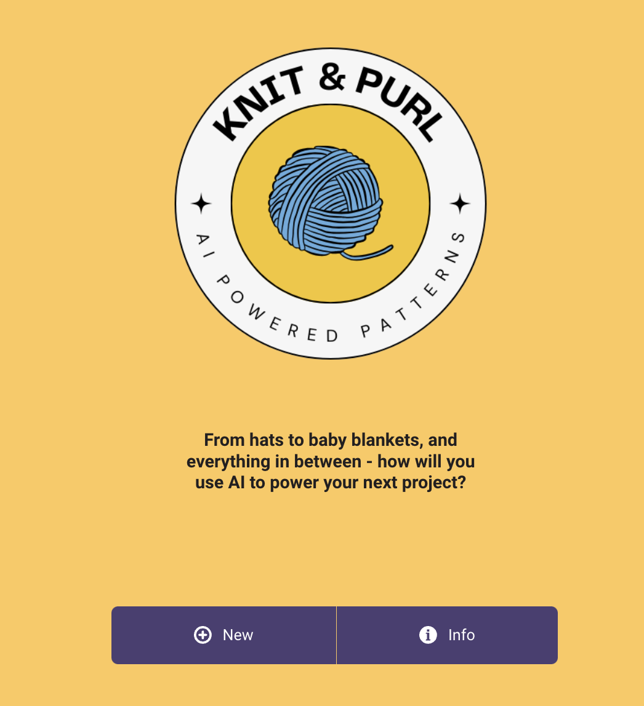
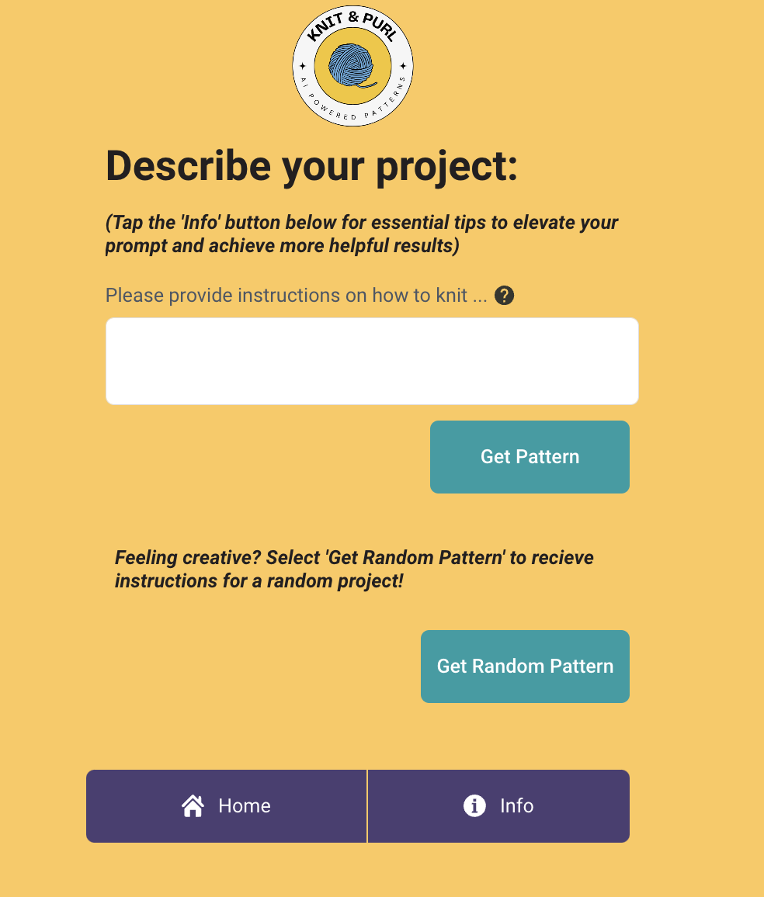
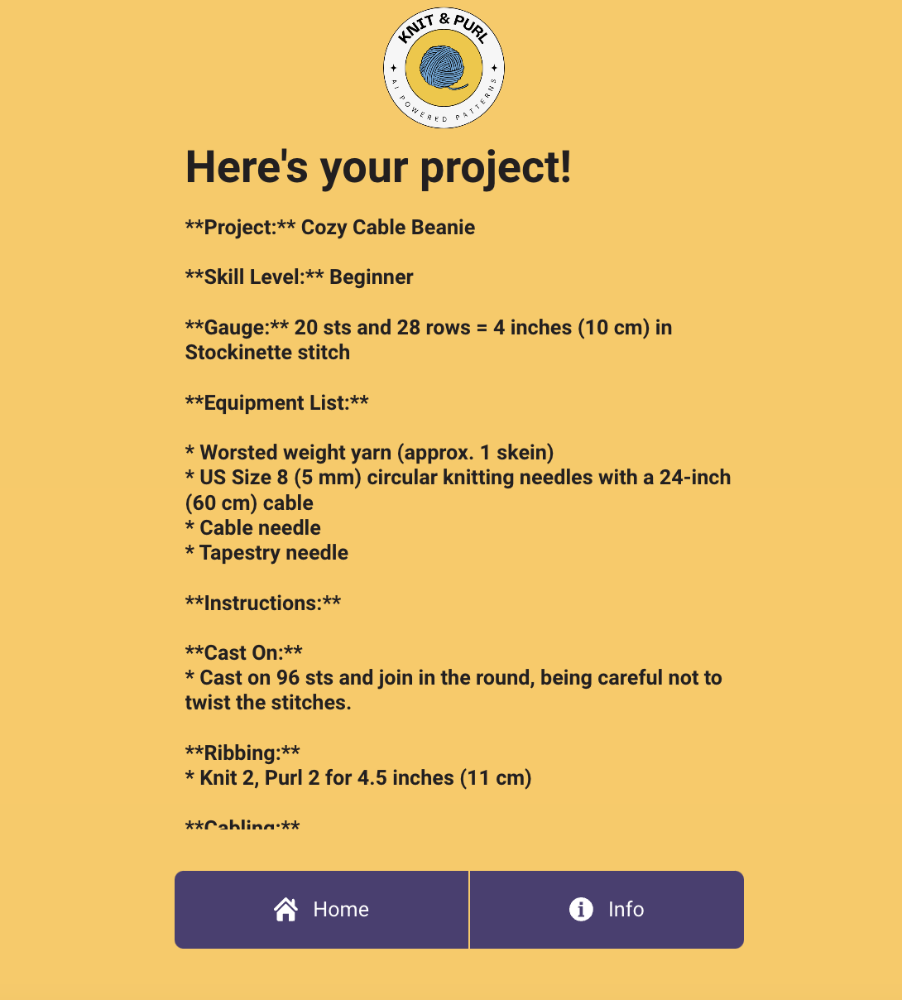
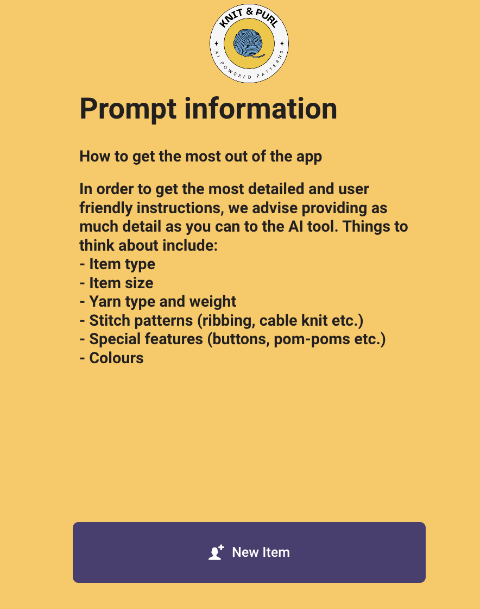
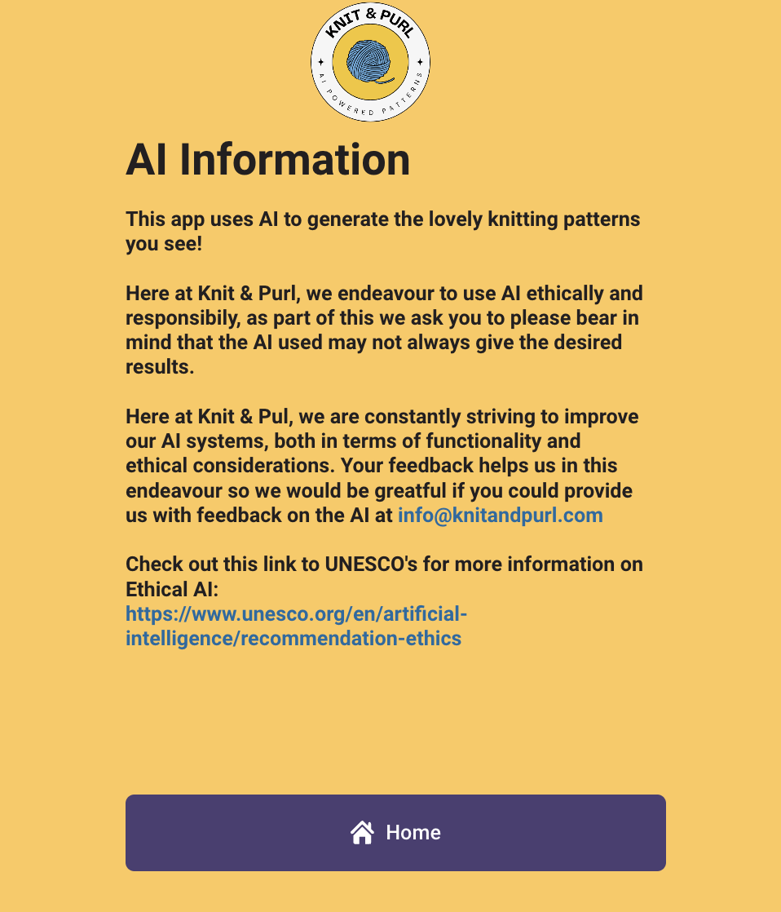

# Knit_and_Purl_Vertex_AI
An AI powered knitting app I created using Google Gemini! The app allows users to ask Google Gemini (Vertex AI) for instructions on how to make a project, or alternatively users can ask for a random project. Low code project using appsmith_

This app is built using Appsmith. Turn any datasource into an internal app in minutes. Appsmith lets you drag-and-drop components to build dashboards, write logic with JavaScript objects and connect to any API, database or GraphQL source.

### [Github](https://github.com/appsmithorg/appsmith) • [Docs](https://docs.appsmith.com/?utm_source=github&utm_medium=social&utm_content=appsmith_docs&utm_campaign=null&utm_term=appsmith_docs) • [Community](https://community.appsmith.com/) • [Tutorials](https://github.com/appsmithorg/appsmith/tree/update/readme#tutorials) • [Youtube](https://www.youtube.com/appsmith) • [Discord](https://discord.gg/rBTTVJp)

##### You can visit the application using the below link

######  

# Knit & Purl AI Knitting App - powered by Google Vertex AI and Appsmith_

In this project I created an app using the _low code_ tool __appsmith__.

In a nutshell, Knit & Purl is a funky AI powered app that uses the Vertex AI to generate knitting pattern instructions and supply lists based on the natural language descriptions users provide. A low code solution.

## Key Features 🔑
* Users can chose whether to request instructions based on a specific item they want to make, or if they are feeling creative they can ask the AI to generate a random knitting pattern.
* The app has a simple but bright UI to make it easy to use but to also inspire creativity in users.
* The app was created in appsmith_, which is a low code solution that enables integration with Google Gemini APIs.
* The specific AI used is the Google Vertex AI.
* When the submit button is selected by a user the Google API is called and teh instructions are extracted from the response.

## Video Demos 📹
__App Demo Here (Youtube) >>>__ [Three minute app demo](https://youtu.be/kY8iEYwwsJ0)

__Low Code Solution Walkthrough Here (Youtube) >>>__ [Five minute low code walkthrough](https://youtu.be/3I6QgtqWPj4)

## Responsible AI 👩‍🏫
* The app contains numerous disclaimers that it is powered by AI, providing transparancy for users.
* Users can chose to view extra information on all screen of the app. The extra infomration lets users know that the knitting instructions are created by AI so are not to be 100% relied on. This screen also provides links to further reading on the ethics of AI, laid out by UNESCO [Link to UNESCO Guidence Here](https://www.unesco.org/en/artificial-intelligence/recommendation-ethics)
* The app extra information screen also provides an email address that users can send any queries or concerns to (note that the email is fictional for the purpose of this project).
* The app also contains a second information screen that provides tips on getting the most out of the tool, namely by providing as much information as possible. The input box also has a minimum character count of 100 to ensure users are putting enough detail in their prompts.

## Where next for Knit & Purl? ⏭️
Next stages for Knit & Purl are:
* Change the format of the text output (adding clearer headings and sections).
* The ability to save and download patterns.
* The ability to get instructions to fix items, rather than just make new ones. This will add an element of __sustainability__ to Knit & Purl, as fixing items, rather than purchasing or making new, is an excellent way to live more sustainably.
* Expand beyond knitting into sewing and crochet.

## Image Gallery 🖼️

__App homepage:__

__User input page:__

__Example 'random' project created by the AI__

__Prompt help screen__

__AI Information page:__

